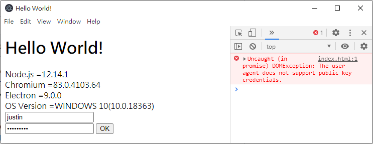

# electron-quick-start
 
for demo Uncaught (in promise) DOMException: The user agent does not support public key credentials.

Node.js = 12.14.1

Chromium = 83.0.4103.64

ELECTRON = 9.0.0

OS Version = WINDOWS 10 (10.0.18363)

# show result

